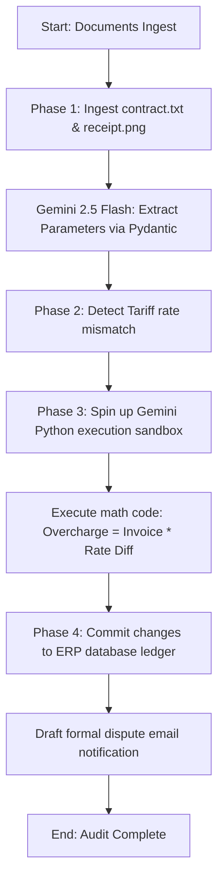

# LogiMind: Autonomous Multimodal Procurement Audit Command Center

LogiMind is an autonomous, agentic audit pipeline designed to ingest visual warehouse documentation, extract parameter definitions, run mathematical compliance checks via secure sandbox code execution, update ERP databases, and draft vendor disputes. 

This project refactors a multi-modal Kaggle Notebook compliance loop into a production-grade FastAPI backend and a premium dark glassmorphic single-page frontend.

---

## Architecture Flow



---

## Key Features

- **FastAPI Integration Layer**: Exposes backend services via CORS-compliant REST endpoints.
- **Multimodal OCR Schema Ingestion**: Natively reads visual customs receipts and unstructured raw text contracts using `gemini-2.5-flash` with structured `response_schema` extraction.
- **Hallucination-Free Math Validation**: Forces the auditing engine to write and execute Python scripts natively inside Gemini's sandbox environment to verify leakages.
- **Database Write-Back**: Automates updating the CSV-based ERP database to lock payments on disputed bills.
- **Escalation Email Builder**: Generates professional dispute letters detailing contract breaches and overcharge maths.
- **Resilient Simulation Fallback**: Automatically activates a **Simulation Mode** using mock model wrappers if `GEMINI_API_KEY` is not present, allowing instant offline testing.

---

## Directory Structure

```
google X kaggle projects/
├── frontend/
│   └── index.html             # Single-page Glassmorphic Interface
└── backend/
    ├── app/
    │   ├── config.py          # Environment, paths, and API client configuration
    │   ├── utils.py           # Injects and creates mockup sandbox directories & files
    │   ├── main.py            # FastAPI Application Server Entrypoint
    │   └── services/
    │       ├── extractor.py   # Ingestion, OCR and Multimodal structured extraction
    │       ├── auditor.py     # Code execution auditing service
    │       └── escalator.py   # Database write-back and dispute email engine
    └── .venv/                 # Python Local Virtual Environment
```

---

## Quick Start Guide

### 1. Run the Backend
Ensure you have Python 3.9+ installed, then run:

```bash
# Navigate to the backend directory
cd "google X kaggle projects/backend"

# Activate the virtual environment
source .venv/bin/activate

# Start the local development server
uvicorn app.main:app --host 0.0.0.5 --port 8000
```
The API documentation will be available at `http://localhost:8000/docs`.

### 2. Run the Frontend
Simply open [index.html](google%20X%20kaggle%20projects/frontend/index.html) in any modern web browser. It will automatically establish a connection with the backend at `http://localhost:8000`.

### 3. Supply API Keys (Optional)
If you wish to test with live Gemini model generation, write your API key to a `.env` file in the `backend/` directory:
```env
GEMINI_API_KEY=your_actual_gemini_api_key_here
```
If no key is configured, the server defaults to **Simulation Mode** automatically to showcase the pipeline's behavior with mock parameters.
